# IMDbClone

## Installation

Requirements:

    
 1.[PHP](https://www.php.net/downloads)
 
 2.[Composer](https://getcomposer.org/download)
 
 3.[Xammp](https://www.apachefriends.org/download.html) (For Server Side Programming, There are other options too but this is my choice)

Initially, if xammp(or any other tool is installed) find the .sql file in the folder 'database' i.e. 'imdbzclone.sql' and import it via Xammp.

    git clone https://github.com/SK1793/IMDbClone.git

<h2>Note</h2>
    
<b>
(P.S-I noticied that some files were missing after uploading to Github So Download the Archieve File "ImdbClone" Uploaded. </b> 

Open the downloaded Project (after Extraction) in any IDE , i here used VS Code 
 
and start with -      
                            
     php artisan key:generate     

     php artisan storage:link 

     php artisan migrate:fresh --seed 
    
     php artisan serve 

(P.S-if above code doesn't start, check above instructions are successfully executed,
Feel Free to suggest with your ideas ☮ )

## Snapshots
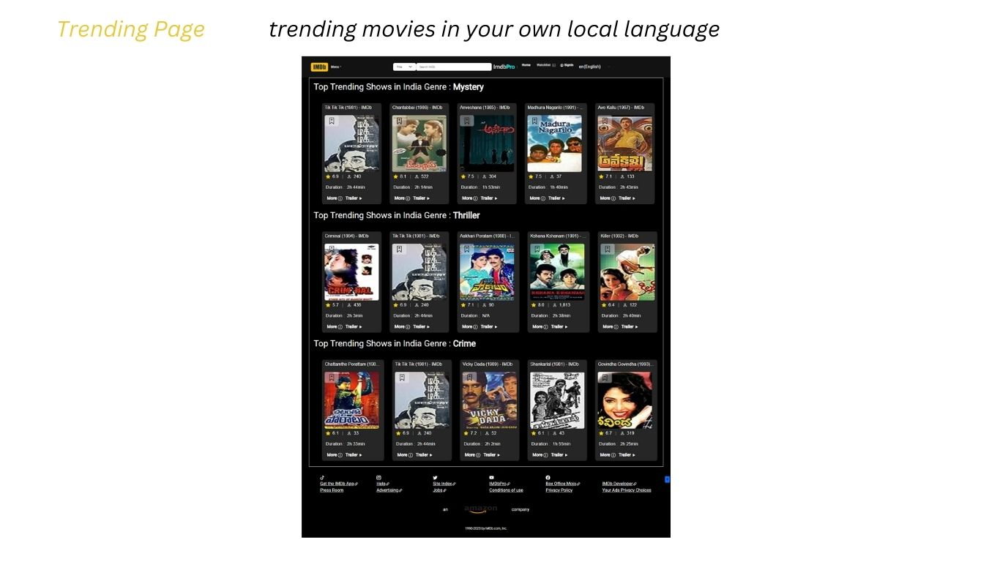

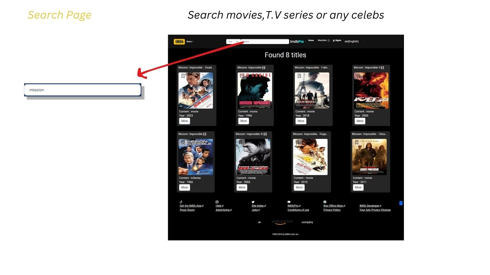

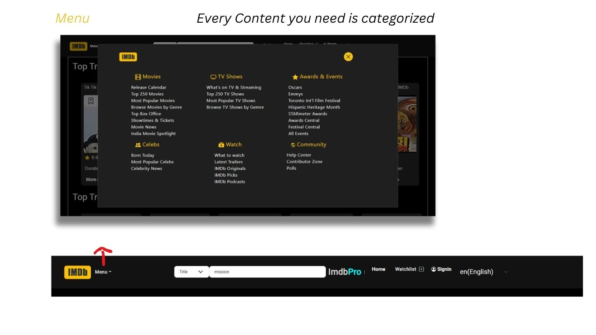

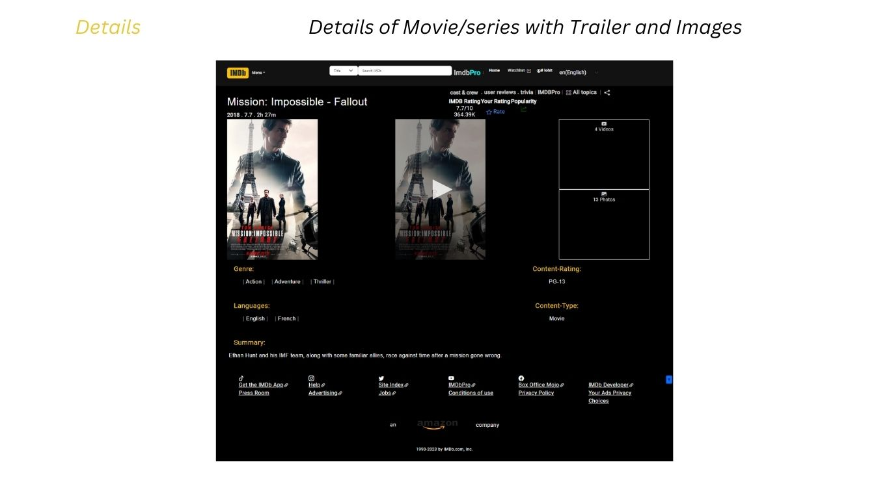

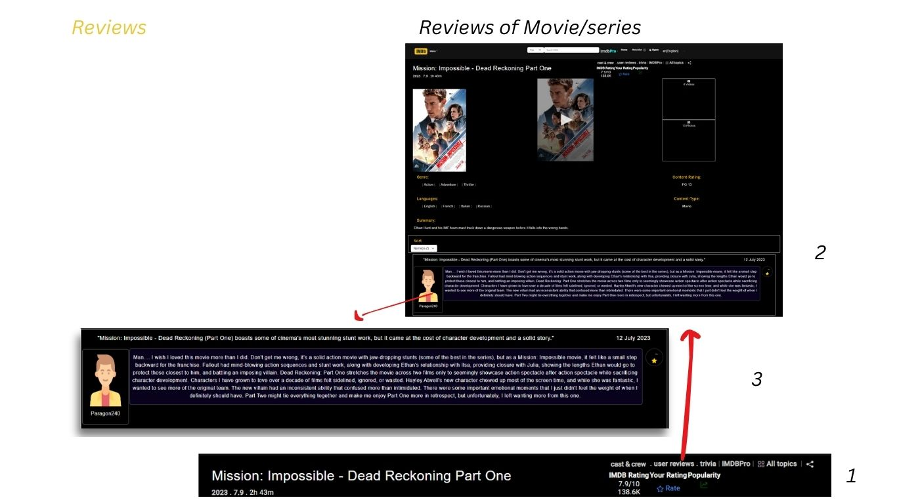

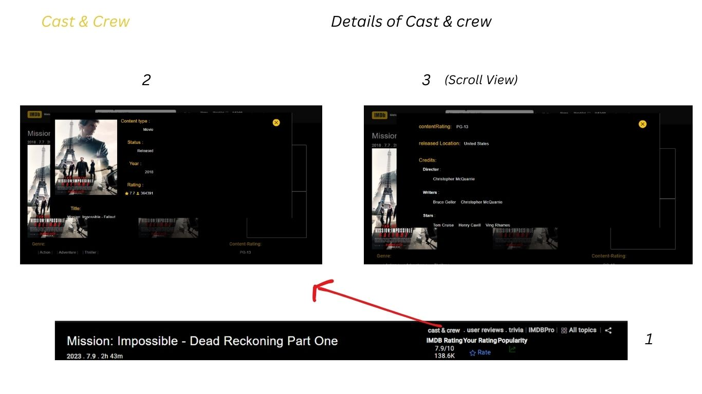

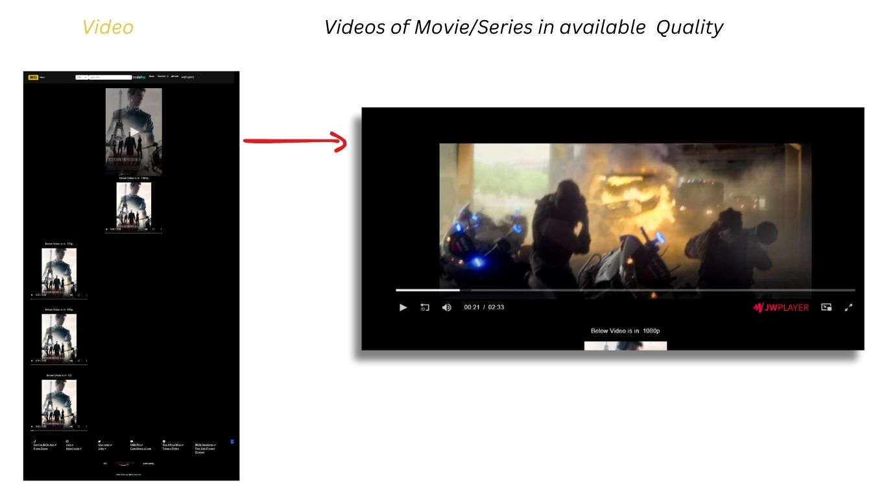

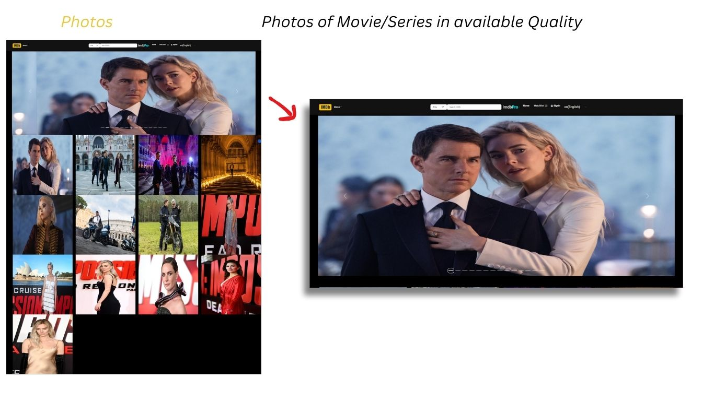

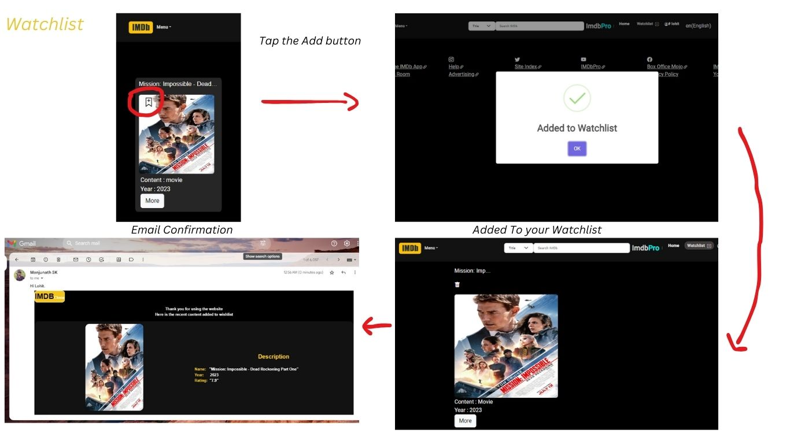

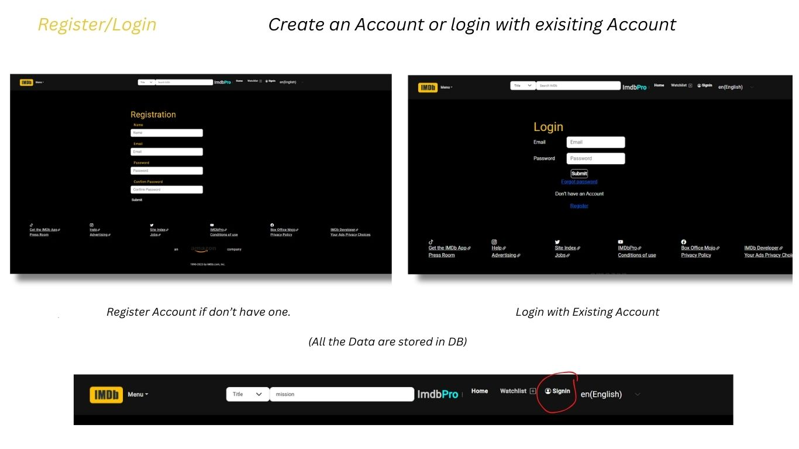

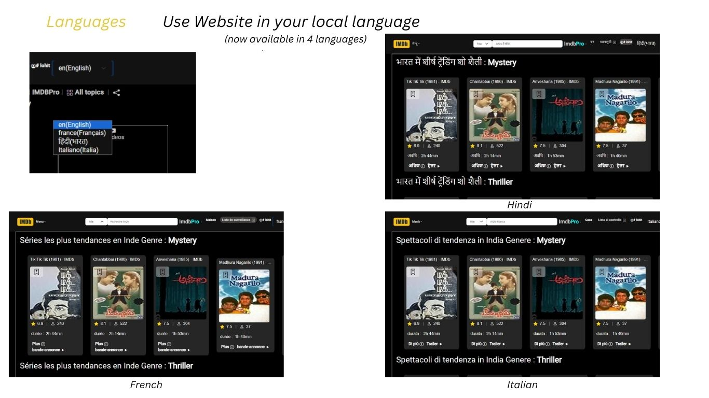

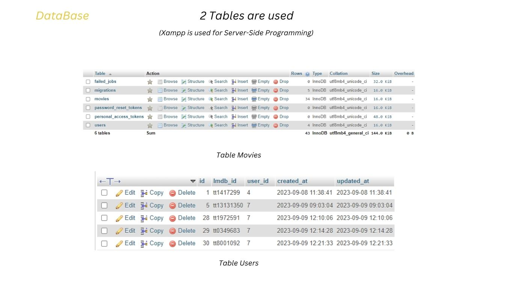

